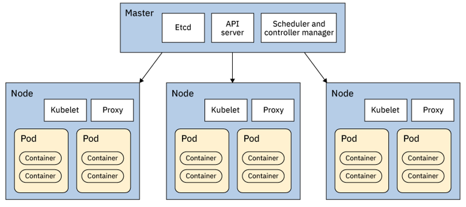

# Kubernetes course

## Set up environement

### Install the IBM Cloud command-line interface (CLI)

Install the IBM Cloud command-line interface. After it’s installed, you can access IBM Cloud from your command line with the prefix ibmcloud.

Log in to the IBM Cloud CLI: ibmcloud login.

For a federated ID: If you have a federated ID, use ibmcloud login –sso to log in to the IBM Cloud CLI. Enter your user name and use the provided URL in your CLI output to retrieve your one-time passcode. You know you have a federated ID if the login fails without the –sso and succeeds with the –sso option.

### Install the IBM Cloud Kubernetes Service plug-in

Create Kubernetes clusters and manage worker nodes by installing the IBM Cloud Kubernetes Service plug-in:

ibmcloud plugin install container-service -r Bluemix

Tip: The prefix for running commands by using the IBM Cloud Kubernetes Service plug-in is ibmcloud cs.

Verify that the plug-in is installed properly:

ibmcloud plugin list

The plug-in is displayed in the results as container-service.

### Install the IBM Cloud Container Registry plug-in

- [Kubernetes course](#kubernetes-course)
  - [Set up environement](#set-up-environement)
    - [Install the IBM Cloud command-line interface (CLI)](#install-the-ibm-cloud-command-line-interface-cli)
    - [Install the IBM Cloud Kubernetes Service plug-in](#install-the-ibm-cloud-kubernetes-service-plug-in)
    - [Install the IBM Cloud Container Registry plug-in](#install-the-ibm-cloud-container-registry-plug-in)
    - [Install the Kubernetes CLI (kubectl)](#install-the-kubernetes-cli-kubectl)
    - [Install Docker](#install-docker)
  - [Provision a cluster](#provision-a-cluster)
  - [Containers](#containers)
  - [Kubernetes](#kubernetes)
    - [Kubernetes, open-sourced orchestration](#kubernetes-open-sourced-orchestration)
    - [Kubernetes architecture](#kubernetes-architecture)
    - [Kubernetes resource model](#kubernetes-resource-model)
    - [Key resources and pods](#key-resources-and-pods)
    - [Kubernetes app deployment workflow](#kubernetes-app-deployment-workflow)

Use this plug-in to set up your own namespace in a multi-tenant, highly available, and scalable private image registry that is hosted by IBM, and to store and share Docker images with other users. Docker images are required to deploy containers into a cluster.

**Tip:** The prefix for running registry commands is ```ibmcloud cr.```

Manage a private image repository by installing the IBM Cloud Container Registry plug-in:

```
ibmcloud plugin install container-registry -r Bluemix
```

Verify that the plug-in is installed properly:

```
ibmcloud plugin list
```

The plug-in is displayed in the results as container-registry.

### Install the Kubernetes CLI (kubectl)

Install the version of [kubectl](https://kubernetes.io/docs/tasks/tools/install-kubectl/) that is the same [Kubernetes version for IBM Cloud Container Service](https://console.bluemix.net/docs/containers/cs_versions.html#cs_versions). Using an older kubectl with a newer server might produce validation errors.

### Install Docker

To locally build images and push them to your registry namespace, [install Docker](https://www.docker.com/community-edition#/download). The Docker CLI is used to build applications into images.

## Provision a cluster

- Before you dive into Kubernetes, you need to provision a cluster for your containerized app. Then, you won’t need to wait for it to be ready for the labs in this course. A cluster is a set of resources, worker nodes, networks, and storage devices that keep apps highly available. After you have your cluster, then you can deploy your apps in containers.

- Be sure you installed the CLIs as described previously.

- Provisioning a cluster can take a few minutes.

- Go to the [IBM Cloud catalog](https://console.bluemix.net/catalog/) and provision a Kubernetes cluster.
Enter a cluster name. Free clusters are deployed in the region that you select, but you cannot choose the location (data center).
Click Create Cluster.

- The worker node in the cluster takes a few minutes to provision. You can see the status of the worker node in the Worker nodes tab. When the status reaches Ready, your worker node is ready to be used.

## Containers

- Containers provide isolation similar to virtual machines (VMs), except provided by the OS and at the process level. Each container is a process or group of processes that are run in isolation. Typical containers explicitly run only a single process because they have no need for the standard system services. What they usually need to do can be provided by system calls to the base OS kernel.

- The isolation on Linux is provided by a feature called namespaces. Each different kind of isolation, that is, user and cgroups, is provided by a different namespace.

- This is a list of some of the namespaces that are commonly used and visible to the user:

```
PID: process IDs
USER: user and group IDs
UTS: host name and domain name
NS: mount points
NET: network devices, stacks, and ports
CGROUPS: control limits and monitoring of resources_
```

- Containers allow you to share the host OS. This reduces duplication while still providing the isolation. Containers also allow you to drop unneeded files such as system libraries and binaries to save space and reduce your attack surface. If SSHD or LIBC are not installed, they cannot be exploited.

## Kubernetes

- Kubernetes is a container orchestrator to provision, manage, and scale apps. In other words, Kubernetes allows you to manage the life cycle of containerized apps in a cluster of nodes (which are a collection of worker machines, for example, VMs or physical machines).

- Your apps might need many other resources to run such as Volumes, Networks, and Secrets that will help you to do things such as connect to databases, talk to firewalled back ends, and secure keys. Kubernetes helps you add these resources into your app. Infrastructure resources needed by apps are managed declaratively.
    - Like Apache Mesos and Docker Swarm, Kubernetes is a container orchestrator to provision, manage, and scale apps.

- The key paradigm of Kubernetes is its declarative model. The user provides the desired state and Kubernetes will do its best to make it happen. If you need five instances, you do not start five separate instances on your own but rather tell Kubernetes that you need five instances, and Kubernetes will reconcile the state automatically. At this point, you simply need to know that you declare the state that you want and Kubernetes makes that happen. If something goes wrong with one of your instances and it crashes, Kubernetes still knows the desired state and creates new instances on an available node.

- Fun to know: Kubernetes goes by many names. Sometimes it is shortened to k8s (losing the internal 8 letters), or kube. The word is rooted in ancient Greek and means “Helmsman.” A helmsman is the person who steers a ship. We hope you can see the analogy between directing a ship and the decisions made to orchestrate containers on a cluster.

### Kubernetes, open-sourced orchestration

- Kubernetes is developed by the community with the intent of addressing container scaling and management needs. So in the early days of Kubernetes, the community contributors leveraged their knowledge of creating and running internal tools, such as Borg and Omega. With the advent of the Cloud Native Computing Foundation (CNCF), the community adopted Open Governance for Kubernetes. IBM, as a founding member of CNCF, actively contributes to CNCF's cloud-native projects, along with other companies such as Google, Red Hat, Microsoft, and Amazon.

### Kubernetes architecture

- At its core, Kubernetes is a data store (etcd). The declarative model is stored in the data store as objects, and that means when you say you want five instances of a container, then that request is stored into the data store. This information change is watched and delegated to Controllers to take action. Controllers then react to the model and attempt to take action to achieve the desired state. The power of Kubernetes is in its simplistic model.

- In the following diagram, an API server is a **simple HTTP server handling create/read/update/delete (CRUD)** operations on the data store. The Controller identifies the change that you want and makes that happen.

- Controllers are responsible for instantiating the actual resource represented by any Kubernetes resource. These actual resources are what your app needs to allow it to run successfully.


### Kubernetes resource model

Kubernetes infrastructure defines a resource for every purpose. Each resource is monitored and processed by a Controller. When you define your app, it contains a collection of these resources. Controllers will then read this collection to build your app’s actual backing instances. Some of the resources that you might work with are described in the following list. For a complete list, see Kubernetes Concepts. In this course, you will only use a few of these resources, such as pod and deployment.

```
Config maps: holds configuration data for pods to consume
Daemon sets: ensures that each node in the cluster runs this pod
Deployments: defines a desired state of a deployment object
Events: provides life cycle events on pods and other deployment objects
Endpoints: allows an inbound connections to reach the cluster services
Ingress: a collection of rules that allows inbound connections to reach the cluster services
Jobs: creates one or more pods and when they complete successfully, the job is marked as completed
Node: a worker machine in Kubernetes
Namespaces: multiple virtual clusters backed by the same physical cluster
Pods: the smallest deployable units of computing that can be created and managed in Kubernetes
Persistent volumes: provides an API for users and administrators to abstract details about how storage is provided from how it is consumed
Replica sets: ensures that a specified number of pod replicas are running at any given time
Secrets: holds sensitive information, such as passwords, OAuth tokens, and SSH keys
Service accounts: provides an identity for processes that run in a pod
Services: an abstraction that defines a logical set of pods and a policy by which to access them, sometimes called a microservice
Stateful sets: the workload API object that manages stateful applications
```




### Key resources and pods

A pod is the smallest object model that you can create and run. You can add labels to a pod to identify a subset to run operations on. When you are ready to scale your app, you can use the label to tell Kubernetes which Pod you need to scale. A pod typically represents a process in your cluster. Pods contain at least one container that runs the job and additionally might have other containers in it called sidecars for monitoring, logging, and so on. Essentially, a pod is a group of containers.

An app is typically a group of pods. Although an entire app can be run in a single pod, you usually build multiple pods that talk to each other to make a useful app. In this course, you’ll see why separating the app logic and back-end database into separate pods scales better when you build an app.

Kubernetes provides a client interface through the kubectl command-line interface. Kubectl commands allow you to manage your apps and manage cluster and cluster resources by modifying the model in the data store.

You directly manipulate resources through YAML, which is a human-readable serialization language:

$ kubectl (create|get|apply|delete) -f myResource.yaml

### Kubernetes app deployment workflow


1. The user deploys a new app by using the kubectl CLI. Kubectl sends the request to the API server.
2. The API server receives the request and stores it in the data store (etcd). After the request is written to the data store, the API server is done with the request.
3. Watchers detect the resource changes and send notifications to the Controller to act on those changes.
4. The Controller detects the new app and creates new pods to match the desired number of instances. Any changes to the stored model will be used to create or delete pods.
5. The Scheduler assigns new pods to a node based on specific criteria. The Scheduler decides on whether to run pods on specific nodes in the cluster. The Scheduler modifies the model with the node information.
6. A Kubelet on a node detects a pod with an assignment to itself and deploys the requested containers through the container runtime, for example, Docker. Each node watches the storage to see what pods it is assigned to run. The node takes necessary actions on the resources assigned to it such as to create or delete pods.
7. Kubeproxy manages network traffic for the pods, including service discovery and load balancing. Kubeproxy is responsible for communication between pods that want to interact.

