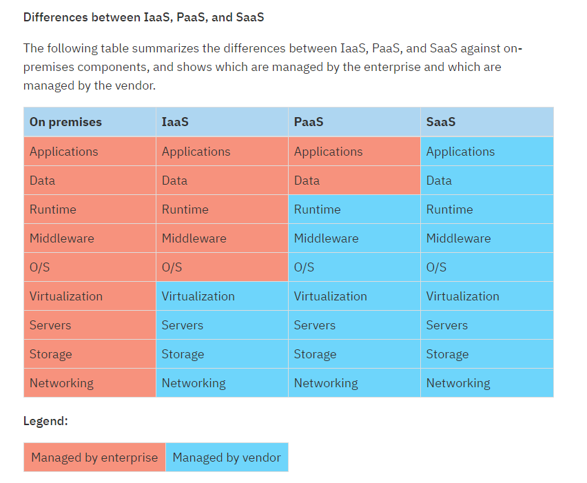

## There are a few major types of models used for cloud computing:

1. 1Infrastructure as a service (IaaS)
2. Platform as a service (PaaS)
3. Software as a service (SaaS)

### Infrastructure as a service

- Infrastructure as a service provides companies with computing resources including servers, networking, storage, and data center space on a pay-per-use basis.

- Benefits of IaaS
    - Clients do not need to invest in their own hardware.
    - Infrastructure scales on demand to support dynamic workloads.
    - Flexible, innovative services are available on demand.

### Platform as a service

- Platform as a service provides a cloud-based environment with everything required to support the complete lifecycle of building and delivering web-based (cloud) applications, without the cost and complexity of buying and managing the underlying hardware, software, provisioning, and hosting.

- Benefits of PaaS
Clients can:
    - Develop applications and get to market faster
    - Deploy new web applications to the cloud in minutes
    - Reduce complexity with middleware as a service

### Software as a service

- Cloud-based applications, or software as a service, run on distant computers "in the cloud" that are owned and operated by others and that connect to users' computers through the internet and, usually, a web browser.

- Benefits of SaaS
    - Clients can sign up and rapidly start using innovative business apps.
    - Apps and data are accessible from any connected computer.
    - No data is lost if the client's computer breaks because data is in the cloud.
    - The service is able to dynamically scale to usage needs.

#### Simply put

- IaaS enables IT infrastructure (servers, virtual machines, storage, networks, and operating systems) to be leased from a cloud provider with a payment system as clients use it.

- PaaS is a cloud computing service that delivers an on-demand environment for the development, testing, delivery, and management of software applications.

- SaaS is a method of delivering software for applications through the Internet on demand, and usually on a subscription basis.

### Anything as a service

It's interesting to note that you might hear mention of a new model positioned as "anything as a service" and commonly referred to as XaaS. This model handles any IT service hosted on a provider's infrastructure that is remotely available over a network. This could include:

- Data as a service (DaaS)
- Storage as a service (STaaS)
- Communication as a service (CaaS)
- Business process as a service (BPaaS)
