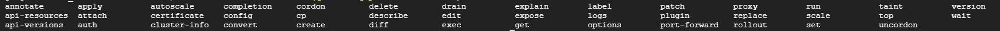
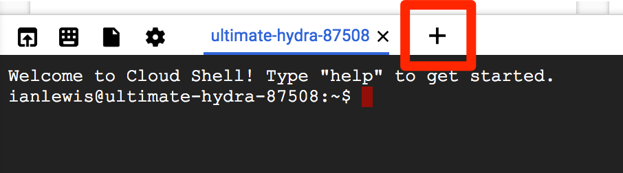

# using kubernetes

- clone https://github.com/kelseyhightower/app


```
Make sure the following APIs are enabled in Cloud Platform Console:

Kubernetes Engine API
Container Registry API
On the Navigation menu (Navigation menu), click APIs & services.

Scroll down and confirm that your APIs are enabled.

If an API is missing, click ENABLE APIS AND SERVICES at the top, search for the API by name, and enable it for your project.
```
```
gcloud auth list
gcloud config list project
```
``` git clone https://github.com/googlecodelabs/orchestrate-with-kubernetes.git```

## Start a kubernetes cluster

1. Define your zone as a project default zone. This way you do not need to specify --zone parameter in gcloud commands.

```gcloud config set compute/zone us-central1-a```

- In Cloud Shell, run the following command to start a Kubernetes cluster called bootcamp that runs 5 nodes.

```
gcloud container clusters create bootcamp --num-nodes 5 --scopes "https://www.googleapis.com/auth/projecthosting,storage-rw"
```
- The scopes argument provides access to project hosting and Google Cloud Storage APIs that you'll use later.

2. After the cluster is created, check your installed version of Kubernetes using the kubectl version command.

kubectl version

- The gcloud container clusters create command automatically authenticated kubectl for you.

3. find out more about the cluster.

```kubectl cluster-info```

## Bash Completion

- enable auto-complete kubectl ```source <(kubectl completion bash)```
    - usage: ```kubectl <TAB><TAB>```




## Run and deploy a container

1. launch a single instance of the nginx container. ```kubectl run nginx --image=nginx:1.10.0```

```
    kubectl run --generator=deployment/apps.v1 is DEPRECATED and will be removed in a future version. Use kubectl run --generator=run-pod/v1 or kubectl create instead.
    deployment.apps/nginx created
```

2. view the pod running the nginx container : ```kubectl get pods```

3. expose the nginx container outside Kubernetes : ```kubectl expose deployment nginx --port 80 --type LoadBalancer```

- Kubernetes created a service and an external load balancer with a public IP address attached to it (you will learn about services later). The IP address remains the same for the life of the service. Any client who hits that public IP address (for example an end user or another container) is routed to pods behind the service. In this case, that would be the nginx pod.

4. view the new service : ```kubectl get services```

- It may take a few seconds before the ExternalIP field is populated for your service. This is normal—just re-run the kubectl get services command every few seconds until the field is populated.

5. scale up the number of backend applications (pods) running on your service using : ```kubectl scale deployment nginx --replicas 3```

6. Get the pods one more time to confirm that Kubernetes has updated the number of pods. ```kubectl get pods```

    - confirm that your external IP address has not changed. ```kubectl get services```

7. Use the external IP address with the curl command to test your demo application. : ```curl http://<External IP>:80```

    - Kubernetes supports an easy-to-use workflow out of the box using the kubectl run, expose, and scale commands.

8. Clean Up

- Clean up nginx by running the following commands.

```kubectl delete deployment nginx```
```kubectl delete service nginx```

## Pods

### Creating Pods

- Pods can be created using pod configuration files.

1. Explore the built-in pod documentation using the kubectl explain command:  ```kubectl explain pods```

- While you explore the Kubernetes API, kubectl explain will be one of the most common commands you use. Note how you used it above to investigate an API object and how you will use it below to check on various properties of API objects.

2. Explore the monolith pod's configuration file. ```cat pods/monolith.yaml```

```
$ cat pods/monolith.yaml
apiVersion: v1
kind: Pod
metadata:
  name: monolith
  labels:
    app: monolith
spec:
  containers:
    - name: monolith
      image: kelseyhightower/monolith:1.0.0
      args:
        - "-http=0.0.0.0:80"
        - "-health=0.0.0.0:81"
        - "-secret=secret"
      ports:
        - name: http
          containerPort: 80
        - name: health
          containerPort: 81
      resources:
        limits:
          cpu: 0.2
          memory: "10Mi"
```

- The pod is made up of one container (called monolith). You pass a few arguments to the container when it starts up and open port 80 for HTTP traffic.

3. Use the kubectl explain command with the .spec option to view more information about API objects. This example inspects containers. ```kubectl explain pods.spec.containers``` result : [result:](resultexplain.md)

4. Create the monolith pod ```kubectl create -f pods/monolith.yaml```

5.  list all pods running in the default namespace. ```kubectl get pods```

6. get more information about the monolith pod. ```kubectl describe pods monolith```

```
What is the pod IP address?
Which node is the pod running on?
Which containers are running in the pod?
Which labels are attached to the pod?
Which arguments are set on the container?
```
```
$ kubectl describe pods monolith
Name:               monolith
Namespace:          default
Priority:           0
PriorityClassName:  <none>
Node:               gke-bootcamp-default-pool-ffbc216a-9lnj/10.128.0.5
Start Time:         Wed, 18 Sep 2019 20:48:48 +0300
Labels:             app=monolith
Annotations:        <none>
Status:             Running
IP:                 10.48.2.3
Containers:
  monolith:
    Container ID:  docker://6285cd976b8632a9a335393d7b196029d0f8536931fa1a5f725b18f1d9e771b6
    Image:         kelseyhightower/monolith:1.0.0
    Image ID:      docker-pullable://kelseyhightower/monolith@sha256:72c3f41b6b01c21d9fdd2f45a89c6e5d59b8299b52d7dd0c9491745e73db3a35
    Ports:         80/TCP, 81/TCP
    Host Ports:    0/TCP, 0/TCP
    Args:
      -http=0.0.0.0:80
      -health=0.0.0.0:81
      -secret=secret
    State:          Running
      Started:      Wed, 18 Sep 2019 20:48:51 +0300
    Ready:          True
    Restart Count:  0
    Limits:
      cpu:     200m
      memory:  10Mi
    Requests:
      cpu:        200m
      memory:     10Mi
    Environment:  <none>
    Mounts:
      /var/run/secrets/kubernetes.io/serviceaccount from default-token-tgrlz (ro)
Conditions:
  Type              Status
  Initialized       True
  Ready             True
  ContainersReady   True
  PodScheduled      True
Volumes:
  default-token-tgrlz:
    Type:        Secret (a volume populated by a Secret)
    SecretName:  default-token-tgrlz
    Optional:    false
QoS Class:       Guaranteed
Node-Selectors:  <none>
Tolerations:     node.kubernetes.io/not-ready:NoExecute for 300s
                 node.kubernetes.io/unreachable:NoExecute for 300s
Events:
  Type    Reason     Age   From                                              Message
  ----    ------     ----  ----                                              -------
  Normal  Scheduled  48s   default-scheduler                                 Successfully assigned default/monolith to gke-bootcamp-default-pool-ffbc216a-9lnj
  Normal  Pulling    47s   kubelet, gke-bootcamp-default-pool-ffbc216a-9lnj  pulling image "kelseyhightower/monolith:1.0.0"
```

- As you can see, Kubernetes makes it easy to create pods by describing them in configuration files and to view information about them when they are running. At this point, you can create all the pods your deployment requires!

### Interacting with pods

- Pods are allocated a private IP address by default that cannot be reached outside of the cluster. Use the kubectl port-forward command to map a local port to a port inside the monolith pod.

- Use two terminals: one to run the kubectl port-forward command, and the other to issue curl commands.

1. Click the + button in Cloud Shell to open a new terminal.



2. set up port-forwarding from a local port, 10080, to a pod port, 80 (where your container is listening). ```kubectl port-forward monolith 10080:80```

3. To access your pod, return to the first terminal window and run the following curl command. ```curl http://127.0.0.1:10080```

4. secure endpoint: ```curl http://127.0.0.1:10080/secure```
- You get an error because you need to include an auth token in your request.

5. Log in to get an auth token from monolith. ```curl -u user http://127.0.0.1:10080/login```
    - At the login prompt, enter the password as password to sign in.
    - Logging in causes a JWT token to be printed out. You'll use it to test your secure endpoint with curl.

6. Cloud Shell doesn't handle copying long strings well, so copy the token into an environment variable.
```
TOKEN=$(curl http://127.0.0.1:10080/login -u user|jq -r '.token')
```
- At the login prompt, enter the password as password to sign in.

7. Access the secure endpoint again, and this time include the auth token.

```curl -H "Authorization: Bearer $TOKEN" http://127.0.0.1:10080/secure```
- You should get a response back from your application letting you know it works again!

8. view logs for the monolith pod. ```kubectl logs monolith```

9. Open another terminal and use the -f flag to get a stream of logs in real-time! ```kubectl logs -f monolith```

10. Use curl in terminal 1 to interact with monolith. And you see logs update in terminal 3. ```curl http://127.0.0.1:10080```

11. Use the kubectl exec command to run an interactive shell inside the monolith pod. This can be useful when you want to troubleshoot from within a container.
```kubectl exec monolith --stdin --tty -c monolith /bin/sh```

12. In the shell, you can test external (outward facing) connectivity using the ping command. ```ping -c 3 google.com```

13. Sign out of the shell.
```exit```

14. To quit kubectl port-forward and kubectl logs in terminal 2 and 3, press Ctrl+C.

## Monitoring and Health Checks

- Kubernetes supports monitoring applications in the form of readiness and liveness probes. Health checks can be performed on each container in a pod. Readiness probes indicate when a pod is "ready" to serve traffic. Liveness probes indicate whether a container is "alive." If a liveness probe fails multiple times, the container is restarted. Liveness probes that continue to fail cause a pod to enter a crash loop. If a readiness check fails, the container is marked as not ready and is removed from any load balancers.

- In this lab, you deploy a new pod named healthy-monolith, which is largely based on the monolith pod with the addition of readiness and liveness probes.

### Creating Pods with Liveness and Readiness Probes

1. Explore the healthy-monolith pod configuration file. ```cat pods/healthy-monolith.yaml```

```
kind: Pod
metadata:
  name: "healthy-monolith"
  labels:
    app: monolith
spec:
  containers:
    - name: monolith
      image: kelseyhightower/monolith:1.0.0
      ports:
        - name: http
          containerPort: 80
        - name: health
          containerPort: 81
      resources:
        limits:
          cpu: 0.2
          memory: "10Mi"
      livenessProbe:
        httpGet:
          path: /healthz
          port: 81
          scheme: HTTP
        initialDelaySeconds: 5
        periodSeconds: 15
        timeoutSeconds: 5
      readinessProbe:
        httpGet:
          path: /readiness
          port: 81
          scheme: HTTP
        initialDelaySeconds: 5
        timeoutSeconds: 1
```

2. Create the healthy-monolith pod using kubectl.
```
kubectl create -f pods/healthy-monolith.yaml
```

3. Pods are not marked ready until the readiness probe returns an HTTP 200 response. Use the kubectl describe command to view details for the healthy-monolith pod.
```
kubectl describe pod healthy-monolith
```

### Readiness Probes

- See how Kubernetes responds to failed readiness probes. The monolith container supports the ability to force failures of its readiness and liveness probes. This enables you to simulate failures for the healthy-monolith pod.

1. Use the kubectl port-forward command in terminal 2 to forward a local port to the health port of the healthy-monolith pod.

```kubectl port-forward healthy-monolith 10081:81```

2. Force the monolith container readiness probe to fail. Use the curl command in terminal 1 to toggle the readiness probe status. Note that this command does not show any output.
```curl http://127.0.0.1:10081/readiness/status```

3. Get the status of the healthy-monolith pod using the kubectl get pods -w command.
```
kubectl get pods healthy-monolith -w
```

4. Press Ctrl+C when there are 0/1 ready containers. Use the kubectl describe command to get more details about the failing readiness probe.
```
kubectl describe pods healthy-monolith
```
```
Readiness probe failed: HTTP probe failed with statuscode: 503
```

5. Notice the events for the healthy-monolith pod report details about failing readiness probes.

To force the monolith container readiness probe to pass, toggle the readiness probe status by using the curl command.
```
curl http://127.0.0.1:10081/readiness/status
```

6. Wait about 15 seconds and get the status of the healthy-monolith pod using the kubectl get pods command.

```
kubectl get pods healthy-monolith
```

### Liveness Probes

Building on what you learned in the previous tutorial, use the kubectl port-forward and curl commands to force the monolith container liveness probe to fail. Observe how Kubernetes responds to failing liveness probes.

1. Use the kubectl port-forward command to forward a local port to the health port of the healthy-monolith pod in terminal 2. ```kubectl port-forward healthy-monolith 10081:81```

2. To force the monolith container readiness probe to pass, toggle the readiness probe status by using the curl command in another terminal. ```curl http://127.0.0.1:10081/healthz/status```

3. Get the status of the healthy-monolith pod using the kubectl get pods -w command. ```kubectl get pods healthy-monolith -w```

4. When a liveness probe fails, the container is restarted. Once restarted, the healthy-monolith pod should return to a healthy state. Press Ctrl+C to exit that command when the pod restarts. Note the restart count.

5. Use the kubectl describe command to get more details about the failing liveness probe. You can see the related events for when the liveness probe failed and the pod was restarted. ```kubectl describe pods healthy-monolith```

- You learned about Kubernetes pods and Kubernetes support for application monitoring using liveness and readiness probes. You also learned how to add readiness and liveness probes to pods and what happens when probes fail.

## Services

### Creating a Service

- Before creating your services, create a secure pod with an nginx server called secure-monolith that can handle HTTPS traffic.

1. Create two volumes that the secure pod will use to bring in (or consume) data.

The first volume of type secret stores TLS cert files for your nginx server.

Return to terminal 1 and create the first volume using the following command:
```kubectl create secret generic tls-certs --from-file tls/```

- **This uploads cert files from the local directory tls/ and stores them in a secret called tls-certs.**

Create the second volume of type ConfigMap to hold nginx's configuration file.

```
kubectl create configmap nginx-proxy-conf --from-file nginx/proxy.conf
```

- This uploads the proxy.conf file to the cluster and calls the ConfigMap nginx-proxy-conf.

2. Explore the proxy.conf file that nginx will use. ```cat nginx/proxy.conf```

- The file specifies that SSL is ON and specifies the location of cert files in the container file system.

3. Explore the secure-monolith pod configuration file.

```cat pods/secure-monolith.yaml```

- Under volumes, the pod attaches the two volumes you created. And under volumeMounts, it mounts the tls-certs volume to the container's file system so nginx can consume the data.

4. Run the following command to create the secure-monolith pod with its configuration data.
```
kubectl create -f pods/secure-monolith.yaml
```

- Now that you have a secure pod, expose the secure-monolith pod externally using a Kubernetes service.

5. Explore the monolith service configuration file.

```cat services/monolith.yaml```

- The file contains:
    - The selector that finds and exposes pods with labels **app=monolith** and **secure=enabled**
    - *targetPort* and **nodePort** that forward external traffic from port 31000 to nginx on port 443.

6. Use the kubectl create command to create the monolith service from the monolith service configuration file.
```
kubectl create -f services/monolith.yaml
```

- The type: NodePort in the Service's yaml file means that it uses a port on each cluster node to expose the service. This means that it's possible to have port collisions if another app tries to bind to port 31000 on one of your servers.

- Normally, Kubernetes handles this port assignment for you. In this lab, you chose one so that it's easier to configure health checks later.

7. Use the gcloud compute firewall-rules command to allow traffic to the monolith service on the exposed nodeport.

```gcloud compute firewall-rules create allow-monolith-nodeport --allow=tcp:31000```

- Now that everything is set up, you should be able to test the secure-monolith service from outside the cluster without using port forwarding.

8. Get an IP address for one of your nodes.

```gcloud compute instances list```

9. Try to open the URL in your browser.

https://<EXTERNAL_IP>:31000

```
It's time for a quick knowledge check. Use the following commands to answer the questions below.
```
kubectl get services monolith
That timed out or refused to connect. What's going wrong?
```

kubectl describe services monolith

Questions:

Why can't you get a response from the monolith service?
How many endpoints does the monolith service have?
What labels must a pod have to be picked up by the monolith service?
```

### Adding Labels to Pods

- Currently the monolith service does not have any endpoints. One way to troubleshoot an issue like this is to use the kubectl get pods command with a label query.

1. Determine that there are several pods running with the monolith label.

```kubectl get pods -l "app=monolith"```

2. But what about app=monolith and secure=enabled?

```kubectl get pods -l "app=monolith,secure=enabled"```

Notice that this label query does not print any results. You need to add the "secure=enabled" label to them.

3. Use the kubectl label command to add the missing secure=enabled label to the secure-monolith pod.

```kubectl label pods secure-monolith 'secure=enabled'```

4. Check to see that your labels are updated.

```kubectl get pods secure-monolith --show-labels```

5. View the list of endpoints on the monolith service.

```kubectl get endpoints monolith```

- And you have one!

6. Test this by testing one of your nodes again.

```
gcloud compute instances list | grep gke-
```

- Open the following URL in your browser. You will need to click through the SSL warning because secure-monolith is using a self-signed certificate.

https://<EXTERNAL_IP>:31000